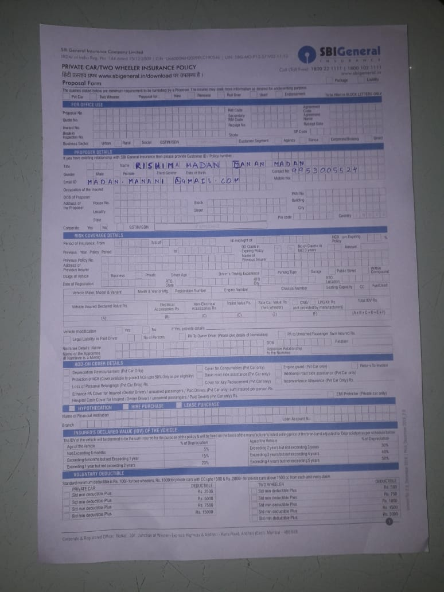
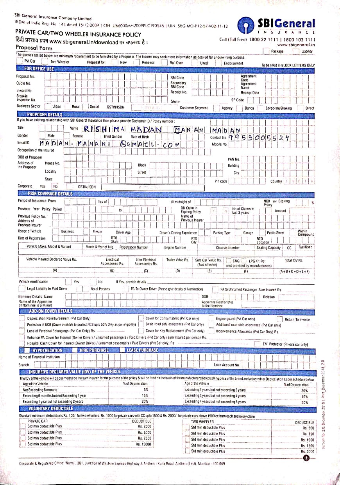
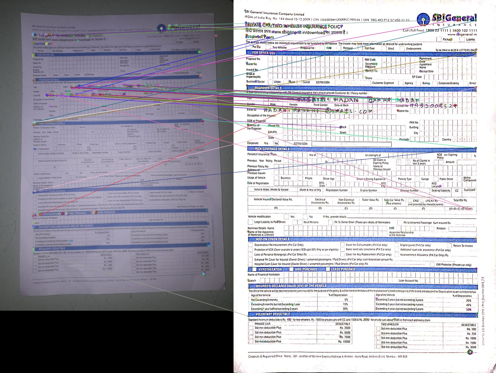
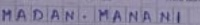
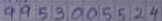
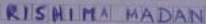

<h1 align="center">Object Character Recognition</h1>
<h2 align="center">On Documents!</h2>

## Methods and Techniques Used

1. **Alignment of Input and Template** 
- *Get the image clicked by the user , allighn the image to the reference image of the same form stored in our database*

|Image Title|Image Preview|
|-----------|-------------|
|Input Image||
|Template Image||

- To do this:
    - I first find ORB features and descriptors in both the images
    - Then I match those features to compute homography matrix

    

    - After computing the homography matrix I apply that on the Input Image to allighn it to template Image.

2. **Extract ROI(Region of Interest)**
- *Extract the ROI from the input image , based on the previously defined co-ordinates for the case of template Images*

- To do this:
    - I first manually measure the co-ordinates of the ROI's in template image (I have to only do this one time for a type of form)
    - Then I extract the ROI's from the already **alligned** input image

3. **OCR on ROI's**
- *Get the ROI's from the previous step and apply preprocessing and pass it to customly configured Tesseract OCR to get the output*

- To do this:
    - I first apply thresholding to the ROI's and then sharpening and Non-Linear Denoising to get the optimum output from OCR.
    - We then pass to the Tesseract OCR which uses an LSTM Model to get the output of the given input image.

- Output
    - Email : : MADAN MANANI
    - Contact Number : :9963005624
    - First Name :  : RISHIM’ BMADAN

- There are some error's but for the most part it is working satisfactorily!
## Model:
- Tesseract's OCR uses an SOTA LSTM Model to classify the given image
- It makes sense to use Sequence Model over CNN as the given image is a sequence and we can exploit temporal relation b/w the sequence in the image.
